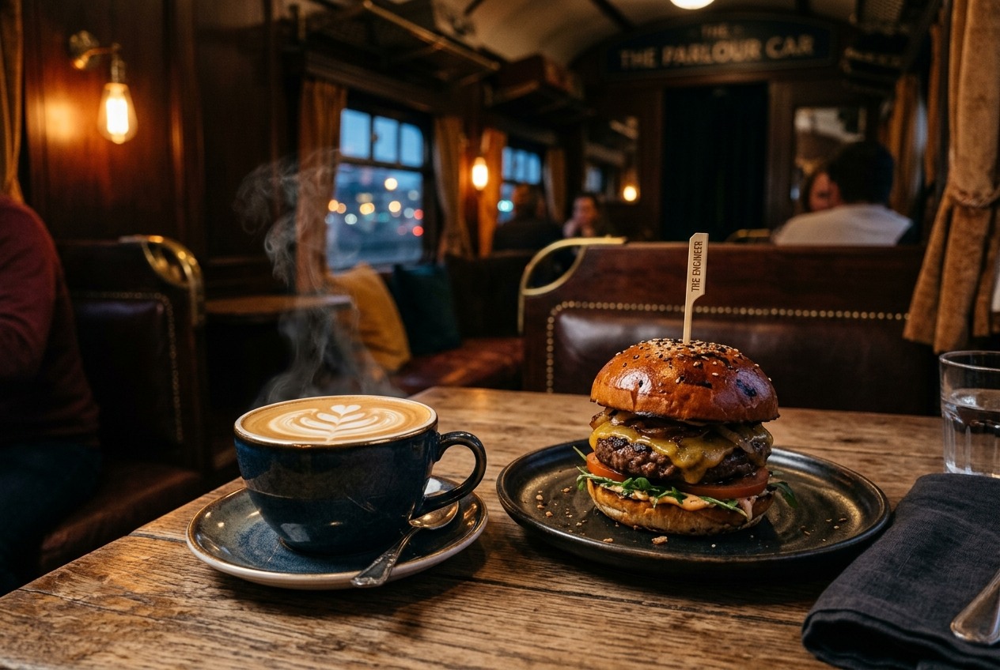

# Wagon Coffee & Food — Website

Mobile-first website for **Wagon Coffee & Food**, a train-themed café in Ankara, bringing together its two sub-brands: **Monkey Express Coffee** and **Mom'y Burgers & Sokak Lezzetleri**.


**Live:** https://vagoncoffe.vercel.app

> Client project — designed and developed by Berke Coşkuner for Wagon Coffee & Food.



## Overview

A digital "station" for a train-concept café in Ankara. Visitors can browse the coffee and food menu, look through the gallery, read about the concept and find contact / directions links — all designed for phones first.

All business data (contact details, social links, menu items) lives in two data files, so content can be updated without touching components. Fields that have not been verified with the business are left empty and are **hidden automatically** in the UI instead of showing placeholder data.

## Features

- **Home page** — full-screen hero, concept section, customer favourites (featured menu items), venue atmosphere, Instagram section and a "Visit us" block with schema.org JSON-LD
- **Menu** (`/menu`) — category filter (coffee, food, desserts, drinks) and search, both synced to the URL query string
- **Product pages** (`/menu/[slug]`) — statically generated for every verified item, with per-product metadata
- **Gallery** (`/galeri`) with filters and an image lightbox, **About** (`/hakkimizda`) and **Contact** (`/iletisim`)
- **Legal pages** — KVKK, privacy policy and cookie policy
- **Mobile bottom navigation** — quick access to menu search, directions, WhatsApp and Instagram
- **SEO** — `sitemap.ts` (includes product routes), `robots.ts` and Open Graph metadata
- Price labels are hidden when a price is not set; users are pointed to WhatsApp / Instagram DM instead

## Tech stack

| Area | Technology |
| --- | --- |
| Framework | Next.js 16 (App Router), React 19, TypeScript |
| Styling | Tailwind CSS v4 |
| Animation | Framer Motion |
| Icons | Lucide React + custom Instagram SVG |
| Images | `next/image` (product and venue images in the repo are AI-generated) |

## Project structure

```text
src/
├── app/
│   ├── page.tsx              # Home page
│   ├── menu/                 # Menu list (MenuClient) + [slug] product pages
│   ├── galeri/  hakkimizda/  iletisim/
│   ├── kvkk/  gizlilik-politikasi/  cerez-politikasi/
│   └── layout.tsx  sitemap.ts  robots.ts
├── components/               # Header, Footer, BottomStickyNav, icons
└── data/
    ├── site-config.ts        # Business info, social links, canonical URL
    └── menu.ts               # Menu items and categories
public/
└── brand/  images/  menu/  gallery/
```

## Getting started

```bash
npm install
npm run dev        # http://localhost:3000
npm run build
npm run start
npm run lint
```

If the project path contains non-ASCII characters (e.g. `Masaüstü`), build with Webpack instead of Turbopack:

```bash
npx next build --webpack
```

### Environment variables

Copy `.env.example` to `.env.local`. Optional:

- `NEXT_PUBLIC_GA_MEASUREMENT_ID`

## Content management

- **Business info** — edit `src/data/site-config.ts` (name, Instagram, phone, WhatsApp, address, maps link, working hours, order links). Empty fields are hidden in the UI.
- **Menu** — edit `src/data/menu.ts`. Each item has `category`, `subcategory`, optional `price`, `image` and a `verified` flag; only verified items are shown and included in the sitemap.
- **Images** — replace files with the same names in `public/brand/`, `public/images/`, `public/menu/` and `public/gallery/`.

---

## Türkçe

**Wagon Coffee & Food** için mobil öncelikli web sitesi. Ankara'daki tren konseptli kafenin iki alt markasını — **Monkey Express Coffee** ve **Mom'y Burgers & Sokak Lezzetleri** — tek bir sitede buluşturur.

> Müşteri projesi — Wagon Coffee & Food için Berke Coşkuner tarafından tasarlanıp geliştirilmiştir.

**Canlı:** https://vagoncoffe.vercel.app

### Özellikler

- Ana sayfa: hero, konsept, müşteri favorileri, mekan atmosferi, Instagram ve "Bizi ziyaret edin" bölümleri (schema.org JSON-LD ile)
- Menü: kategori filtresi (kahve, yemek, tatlı, içecek) ve arama; URL ile senkron
- Her doğrulanmış ürün için statik olarak üretilen ürün detay sayfaları
- Galeri (filtre + lightbox), Hakkımızda, İletişim, KVKK, gizlilik ve çerez politikası sayfaları
- Mobil alt navigasyon: menü araması, yol tarifi, WhatsApp, Instagram
- `sitemap.ts`, `robots.ts` ve Open Graph ile SEO; fiyatı girilmemiş ürünlerde fiyat etiketi gizlenir

### Teknolojiler

Next.js 16 (App Router), React 19, TypeScript, Tailwind CSS v4, Framer Motion, Lucide ikonları. Repodaki ürün ve mekan görselleri yapay zekâ ile üretilmiştir.

### Kurulum

```bash
npm install
npm run dev        # http://localhost:3000
npm run build
```

Proje yolunda Türkçe karakter (ör. `Masaüstü`) varsa Turbopack yerine Webpack ile derleyin: `npx next build --webpack`.

Ortam değişkeni (opsiyonel): `NEXT_PUBLIC_GA_MEASUREMENT_ID` — `.env.example` dosyasını `.env.local` olarak kopyalayın.

### İçerik yönetimi

- İşletme bilgileri: `src/data/site-config.ts` — boş bırakılan alanlar (telefon, WhatsApp, adres, harita linki vb.) arayüzde otomatik gizlenir.
- Menü: `src/data/menu.ts` — yalnızca `verified: true` olan ürünler gösterilir; `price` boşsa fiyat etiketi gizlenir.
- Görseller: `public/brand/`, `public/images/`, `public/menu/`, `public/gallery/` klasörlerindeki dosyaları aynı adla değiştirin.

---

Built by [Berke Coşkuner](https://github.com/CoskunerBerke)
